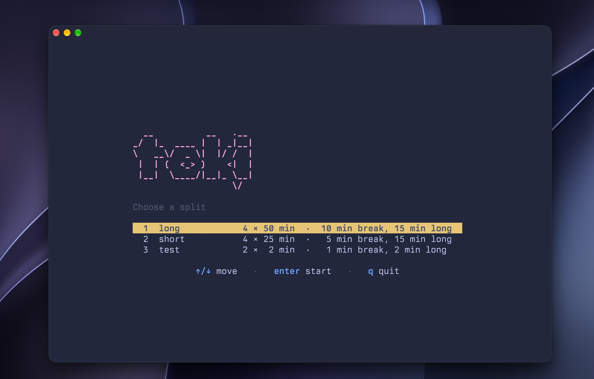
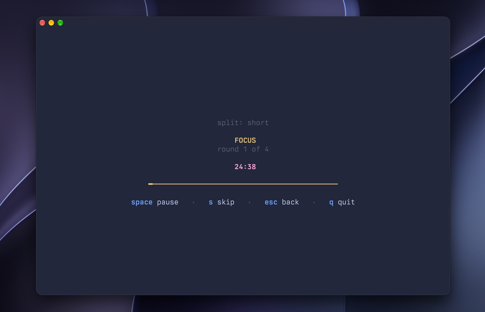

# toki (とき) 🍅

A Pomodoro timer for the terminal.





## Features

- Full-screen timer built with [Bubble Tea](https://github.com/charmbracelet/bubbletea)
- Real Pomodoro rhythm: several focus rounds, a short break between each, and a
  longer one after the last
- Pause, resume and skip phases without stopping
- Countdown that tracks the wall clock, so it stays accurate across a suspend
- A summary of what you actually focused, not what the plan called for
- Today's total on the picker and under the progress bar, moving as rounds finish
- `toki --stats` and `toki --history` to look back, printed like `--list`
- Configurable splits via YAML
- A completion sound per phase, on by default but easy to swap or delete
- Live progress bar, and colour that respects the terminal's own palette
- No account, no network, no telemetry — the history is a plain text file you can
  read and delete

## Installation

```bash
go install github.com/bishalr0y/toki/cmd/toki@latest
```

Or build from source:

```bash
git clone https://github.com/bishalr0y/toki
cd toki
just build
./bin/toki
```

## Usage

```bash
toki                      # start the interface and pick a split
toki --stats              # print today's focus and round count
toki --history            # print every recorded split in the last 3 months
toki --stats --history    # both, in one go
toki --list               # print the configured splits and exit
toki --help               # show the help and exit
toki --version            # print the version and exit
```

Pick a split with `↑` `↓` and `enter`, or press its number to start it
immediately. `q` quits from anywhere; `esc` abandons a split without recording
it.

`toki --list` prints the splits as they will actually run, so it is the quickest
way to check that an edit to `config.yaml` took effect without launching
anything.

Today's total appears on the split picker and under the progress bar while a
session runs, moving as each round finishes. Abandoning a split with `esc` records
nothing.

### Reports

`--stats` and `--history` print and exit rather than opening the interface, the
same as `--list`, so the output can be piped:

```
$ toki --stats

today  ────────────────────

╭─────────  ────────  ────────╮
│ focused  rounds   splits   │
├─────────  ────────  ────────┤
│ 4h 10m   8       2      │
╰─────────  ────────  ────────╯
```

```
$ toki --history

last 3 months  ──────────────────────────────

╭────────────  ────────  ─────────  ───────  ────────╮
│ date        split  focused    rounds   ended    │
├────────────  ────────  ─────────  ───────  ────────┤
│ 2026-10-10  long   3h 20m   4       15:49   │
│             short  50m      4       13:49   │
│ 2026-10-09  long   3h 20m   4       09:30   │
│ 2026-10-08  short  25m      1       16:45   │
╰────────────  ────────  ─────────  ───────  ────────╯

7h 55m  ·  13 rounds  ·  4 splits
```

Give both flags to print both reports.

### Keys

| Key      | Menu           | Session          | Summary  |
| -------- | -------------- | ---------------- | -------- |
| `↑` `↓`  | move           | –                | –        |
| `1`–`9`  | start that one | –                | –        |
| `enter`  | start          | –                | back     |
| `space`  | –              | pause / resume   | –        |
| `s`      | –              | skip the phase   | –        |
| `esc`    | –              | back to the menu | –        |
| `q`      | quit           | quit             | back     |

## Configuration

Config is stored at `~/.config/toki/config.yaml`. Every split needs a name, a
focus length and a break length:

```yaml
timers:
  - name: Standard
    focus: 25
    break: 5
  - name: Long Focus
    focus: 50
    break: 10
```

A split also runs several focus rounds, with a long break after the last one.
Both are optional and default to four rounds and a fifteen minute rest:

```yaml
timers:
  - name: Standard
    focus: 25
    break: 5
    cycles: 4 # focus rounds before the long break
    long_break: 15 # minutes of rest after the last round
```

So the split above runs focus, break, focus, break, focus, break, focus, long
break — and is then finished, with a summary of what you actually worked.

## Completion sound

toki plays a short chime each time a phase ends, so a fresh install is not
silent. The sound ships in the binary and is written to your config directory the
first time toki runs:

```
~/.config/toki/sound.wav
```

The name is fixed; only the format is up to you. toki looks for `sound.wav` and
then `sound.mp3`, so a `.wav` wins if you keep both. To use your own sound,
replace the file — any `.wav` or `.mp3` you drop in works, as long as it keeps
the name. To turn the sound off, delete the file; toki will not put it back.

Playback is best-effort. toki hands the file to whichever player is installed
and can actually play that format — `afplay` on macOS, `paplay`/`aplay`/`pw-play`
for WAV, `mpg123` for MP3, and `mpv`/`ffplay`/`mplayer` for anything — and it
never blocks the countdown. If there is no sound file, or no player that can
handle it, the phase simply passes in silence; toki will not nag you about it.

## What it keeps

A record of the splits you finished, and nothing else. toki writes no logs, keeps
no telemetry and never touches the network — the history is a file on your own
machine, and it is yours to read or delete.

```
~/.config/toki/sessions.jsonl
```

It is plain text, one JSON record per line:

```json
{"name":"long","focused_s":12000,"rounds":4,"ended_at":"2026-10-08T14:32:00Z"}
```

Only what actually happened is stored, so a skipped phase makes for a shorter
`focused_s` than the split called for. Nothing about *what* you worked on is kept,
only that a split named `long` ran.

Records older than three months are removed as new ones are written, which is the
same window `--history` shows. To erase everything, delete the file — there is no
database directory, index or journal to clean up, and toki starts empty.

The rest of what it writes is its own setup:

- **`config.yaml`** is written whenever it is missing, including on the first
  run. Delete it and the next run writes a fresh default in its place.
- **`sound.wav`** is written only on the run that creates `config.yaml`, and
  never over a file that is already there. Delete it and it stays gone: toki
  will not put it back while `config.yaml` exists.

Beyond those, toki only reads. If you would rather keep no record at all, deleting
`sessions.jsonl` is enough — and note that a dotfile manager is probably copying
that folder for you already.

## Development

```bash
just test    # Run tests
just lint    # Run linter
just run     # Build and run
```
